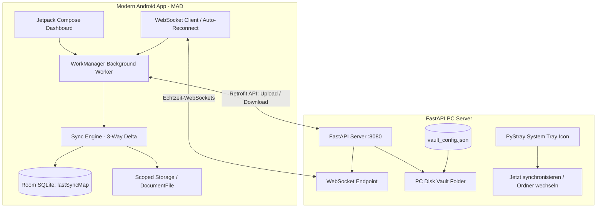

# 🔄 VaultLink
> **Ultra-Premium, Silent, Zero-Latency 3-Way Obsidian Synchronization**

VaultLink ist ein hochoptimiertes, ausfallsicheres Synchronisations-System, das deine Obsidian-Notes in Echtzeit zwischen deinem **Android-Smartphone (Scoped Storage)** und deinem **Windows-PC** abgleicht. 

Das System ist nach modernsten Architektur-Standards gebaut, arbeitet vollkommen geräuschlos im Hintergrund und verbraucht dank intelligenter Delta-Berechnung und WebSocket-Triggern nahezu keine Batterie oder Systemressourcen.

---

## 🏗️ System-Architektur

Das System besteht aus zwei perfekt aufeinander abgestimmten Komponenten:



### 1. 📱 Android-Client (Kotlin)
*   **Jetpack Compose & Material 3**: Ein hochmodernes, ansprechendes Dashboard zur Überwachung des Sync-Status.
*   **Scoped Storage (DocumentFile API)**: Volle Kompatibilität mit Android 10+ Speicherrichtlinien. Liest und schreibt deine Obsidian-Vaults sicher, ohne globale Dateirechte zu verlangen.
*   **Room Database**: Speichert kryptografische Hashes (`SHA-256`) und Zeitstempel der Dateien des letzten erfolgreichen Syncs (`lastSyncMap`), um präzise 3-Wege-Deltas zu ermitteln.
*   **WorkManager**: Führt die Synchronisation sicher im Hintergrund aus – nur im WLAN und akkuschonend.
*   **WebSocket Client mit Auto-Reconnect**: Lauscht permanent auf Sync-Signale des PCs. Bricht die Verbindung ab (z. B. durch Verlassen des Heimnetzwerks), versucht ein robuster **5-Sekunden-Exponential-Retry-Loop** vollautomatisch die Wiederverbindung, sobald du wieder im Netz bist.

### 2. 🖥️ Windows PC-Server (Python)
*   **FastAPI & Uvicorn**: Ein asynchroner, performanter REST- und WebSocket-Server.
*   **PyStray System Tray**: Nistet sich elegant in deine Windows-Taskleiste ein. Zeigt über Ampelfarben (Grün/Rot) den Status an.
*   **Native Ordnerauswahl**: Ermöglicht das interaktive Wechseln deines Obsidian-Vaults direkt über den Tray via nativem Windows-Dateiwähler (`tkinter.filedialog`). Speichert den gewählten Pfad persistent in `vault_config.json`.
*   **Lautloser Autostart**: Startet beim Windows-Boot vollkommen unsichtbar im Hintergrund über ein optimiertes VBScript, ohne dass ein störendes Konsolenfenster aufpoppt.

---

## ⚙️ 3-Wege-Sync-Logik (Three-Way Merge)

Das System nutzt einen echten 3-Wege-Abgleich, um Datenverlust zu verhindern. Es vergleicht drei Zustände:
1.  **Lokaler Zustand (`localMap`)**: Physische Dateien auf dem Handy.
2.  **Remote-Zustand (`remoteMap`)**: Physische Dateien auf dem PC.
3.  **Letzter Sync (`lastSyncMap`)**: Der in der Room-Datenbank gespeicherte Zustand.

Dadurch erkennt das System präzise:
*   **Uploads**: Auf dem Handy neu erstellt oder bearbeitet.
*   **Downloads**: Auf dem PC neu erstellt oder bearbeitet.
*   **Löschungen**: Dateien, die auf einer Seite gelöscht wurden, werden sicher auf die andere Seite übertragen (gelöschte Dateien auf dem PC werden sicherheitshalber in einen `.trash`-Ordner verschoben!).
*   **Konflikte**: Wenn eine Datei auf *beiden* Seiten seit dem letzten Sync geändert wurde, wird ein Konflikt in der Datenbank gemeldet, statt Daten blind zu überschreiben.

---

## 🚀 Setup & Installation

### 1. 🖥️ PC-Server (Windows)
1.  Stelle sicher, dass du Python 3.10+ installiert hast.
2.  Installiere die Abhängigkeiten im Verzeichnis `pc_server`:
    ```bash
    pip install -r pc_server/requirements.txt
    ```
3.  **Autostart einrichten (Optional, dringend empfohlen)**:
    *   Drücke `Win + R`, gib `shell:startup` ein und drücke Enter.
    *   Kopiere die Datei `pc_server/VaultLink.vbs` in diesen Ordner.
    *   *(Pfade im VBS-Skript ggf. an deine Python-Umgebung anpassen)*.
    *   Ab jetzt startet der Server bei jedem Windows-Boot komplett lautlos im Hintergrund.
4.  **Vault-Pfad wählen**:
    *   Klicke mit der rechten Maustaste auf das grüne Symbol im System Tray und wähle **"Vault-Ordner ändern..."**.
    *   Wähle deinen Obsidian-Vault-Ordner aus. Der Pfad wird ab jetzt dauerhaft gespeichert!

### 2. 📱 Android-App
1.  Öffne das Root-Verzeichnis dieses Projekts in **Android Studio**.
2.  Flashe die App auf dein über ADB verbundenes Smartphone (Play-Button klicken).
3.  Wähle beim ersten Start in der App deinen Obsidian-Vault-Ordner auf dem Telefonspeicher aus (Scoped Storage Freigabe).
4.  **Fertig!** Das System synchronisiert ab jetzt vollautomatisch im Hintergrund.

---

## 📝 Lizenz
Dieses Projekt ist unter der MIT-Lizenz lizenziert. Entwickelt mit ❤️ für maximale Produktivität und Datensicherheit.
